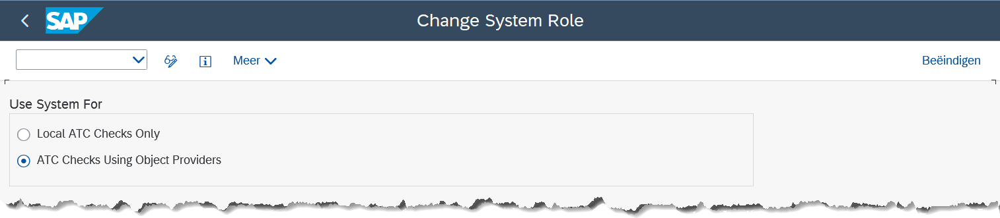

# Setup of the Central Check System

## Goal 🎯

The goal of this file is to document the setup of the Central Check System for ATC.

## References 📝
- [Assigning System Role](https://help.sap.com/docs/ABAP_PLATFORM_NEW/ba879a6e2ea04d9bb94c7ccd7cdac446/0a107af6e9de46129a866fa08cccc640.html?locale=en-US)

## Setup System Role 🛠️

By setting up the system role you can specify the current system as a central check system for remote ATC checks.

Log on to the ATC central check system as ATC administrator and call transaction ATC. Under ATC Administration -> Setup double-click the Set System Role entry:
  
  

> [!IMPORTANT]
> Remember, if you use this option, you <mark>cannot execute local ATC checks</mark> in the current system. If you use this option, ATC findings and results can only be displayed in SAP GUI. Access using ATC tools in the Eclipse-based ABAP Development Tools is then only possible by performing checks from connected development systems.

> [!Note]
> With this ATC use case, the current system takes on the role of the Central Check System and is automatically the ATC master system. For remote access, the Central Check System must provide RFC destinations for each system to be checked.
